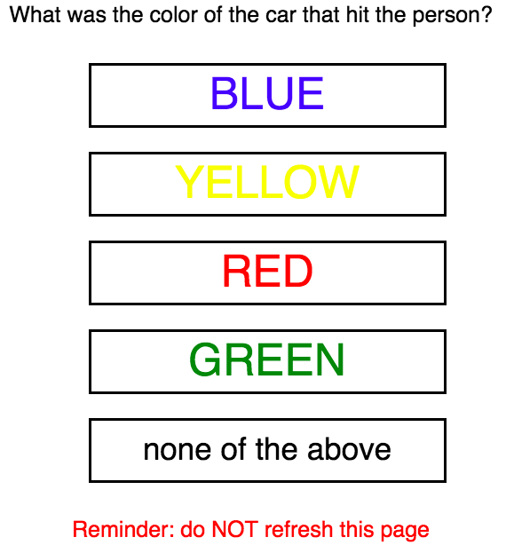
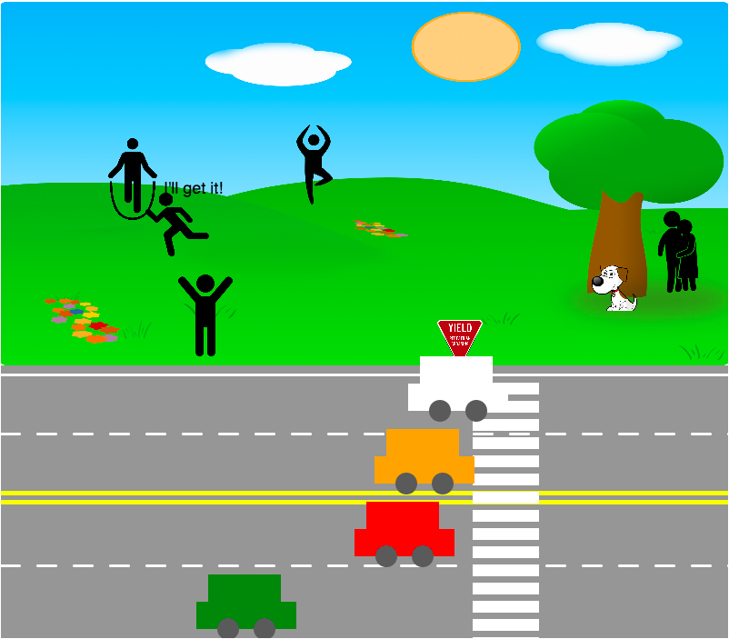

# Science Fair Eyewitness Experiment

### About

* Coded an animation that tests recollection levels during varying time periods

### Screenshots

### Features

* An animation of a "crime scene" that features moving objects
* Form that collects user response
* Firebase Itegration to collect data
